<div align="center">

<picture>
  <source media="(prefers-color-scheme: dark)" srcset="./dark.svg">
  <source media="(prefers-color-scheme: light)" srcset="./light.svg">
  
</picture>

</div>

# Olá, eu sou o **olverclock** 👋

**Técnico de Informática · Suporte Remoto · Automação · IA · Self-hosted · Open Source**

Desenvolvo ferramentas, automações e projetos próprios focados em **resolver problemas reais**. Minha atuação combina mais de **10 anos de experiência** em suporte e manutenção de computadores com desenvolvimento de software, infraestrutura, servidores Linux, automação e experimentação com novas tecnologias.

> **Liberdade · Igualdade · Fraternidade**

## `~/sobre-mim`

```bash
olver@github:~$ whoami
Técnico de Informática + Suporte Remoto
Infraestrutura + Software
Brasil

olver@github:~$ focus
IA | Python | Automação | Servidores | Docker | Linux
APIs | Web | Streaming | Bots | WordPress | Infraestrutura
```

Meu foco é unir **infraestrutura e software**: entender o problema, investigar a causa e construir uma solução prática — seja configurando um ambiente, automatizando uma tarefa, desenvolvendo uma API, criando ferramentas próprias ou integrando serviços.

## `~/stack`

| Área | Tecnologias |
|---|---|
| **Linguagens** | Python · JavaScript · TypeScript · PHP · C# · C++ · Java · Bash · HTML/CSS |
| **Backend / APIs** | Node.js · FastAPI |
| **Infraestrutura** | Linux · Docker · Cloudflare |
| **Dados** | SQLite · MySQL |
| **Web / CMS** | WordPress |
| **3D / Streaming** | Three.js · OBS |
| **Ferramentas** | Git · GitHub |

## `~/interesses-técnicos`

```text
[ IA e automação       ]  [ Self-hosted e servidores ]
[ Linux e Docker       ]  [ APIs e desenvolvimento web ]
[ Bots e integrações   ]  [ Streaming e OBS ]
[ Jogos e ferramentas  ]  [ WordPress e infraestrutura ]
```

## `~/projetos`

Estou sempre experimentando, construindo e evoluindo projetos próprios.

➡️ **[Ver meus repositórios públicos](https://github.com/olverclock?tab=repositories)**

## `~/atividade-github`

<div align="center">


</div>

<div align="center">


</div>

> As estatísticas acima são geradas dinamicamente a partir da atividade pública do GitHub e podem depender da disponibilidade dos serviços externos utilizados para renderizá-las.

## `~/objetivo`

```text
resolver problemas
    ↓
entender o sistema
    ↓
automatizar o repetitivo
    ↓
construir ferramentas
    ↓
aprender, melhorar e compartilhar
```

---

<div align="center">

**Infraestrutura + Software · Criatividade + Solução de Problemas**

[GitHub](https://github.com/olverclock)

</div>
